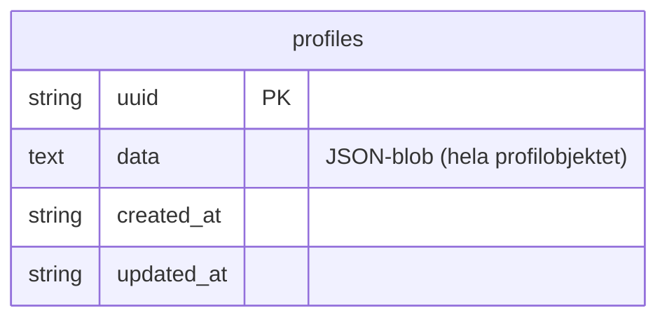

# CV Optimizer — AI-drivet karriärverktyg

Webbapplikation som hjälper användare att strukturera CV:n, bygga kompetensbanker och matcha mot jobbannonser med hjälp av AI.

All data lagras lokalt i webbläsaren (IndexedDB). AI-anrop går direkt från webbläsaren till valfri leverantör (OpenAI, Anthropic, Gemini eller Ollama) — inga server-hemmeligheter krävs.

En liten FastAPI-backend hanterar publicering av profiler (sökning och matchning mot kandidater).

---

## Kom igång

### Frontend

Kräver Python 3 (endast för den lokala utvecklingsservern).

```bash
cd frontend
python serve.py
```

Öppna `http://localhost:5501` i webbläsaren.

> `serve.py` är en SPA-medveten server som skickar alla okända sökvägar till `/`.

---

### Backend

Kräver Python 3.11+.

```bash
cd backend
python3 -m venv .venv
source .venv/bin/activate
pip install -r requirements.txt
```

Starta servern:

```bash
uvicorn main:app --reload --port 8018
```

API tillgängligt på `http://localhost:8018`. Swagger-dokumentation: `http://localhost:8018/docs`.

Databasen (`cv_optimizer.db`) skapas automatiskt i `backend/`-mappen vid första start.

---

## Teknikstack

**Frontend**
- Vanilla JS + CSS (ingen ramverk)
- IndexedDB för lokal datalagring
- Direkta API-anrop till OpenAI / Anthropic / Gemini / Ollama
- PDF-parsning via pdf.js i webbläsaren

**Backend**
- Python / FastAPI
- SQLite (WAL-läge) — ingen extern databas krävs

---

## Projektstruktur

```
cv-optimizer/
├── frontend/
│   ├── index.html          # SPA-ingångspunkt
│   ├── serve.py            # Lokal utvecklingsserver (port 5501)
│   ├── js/
│   │   ├── app-state.js    # Delat tillstånd och apiFetch-dispatcher
│   │   ├── db.js           # IndexedDB-wrapper (window.cvDb)
│   │   ├── ai.js           # AI-abstraktionslager (window.cvAI)
│   │   ├── app.js          # Init och event listeners
│   │   ├── app-cv.js       # CV-uppladdning och visning
│   │   ├── app-bank.js     # Kompetensbank
│   │   ├── app-sokprofil.js  # Sökprofil
│   │   ├── app-kandidater.js # Kandidathantering
│   │   ├── app-match.js    # Jobbmatchning och CV-generering
│   │   ├── app-account.js  # Kontoinställningar och AI-konfiguration
│   │   └── translations.js # Flerspråksstöd (sv/en)
│   └── css/
│       └── style.css
└── backend/
    ├── main.py             # FastAPI-app med SQLite
    ├── requirements.txt
    └── cv_optimizer.db     # Skapas automatiskt (ignoreras av git)
```

---

## API-endpoints (backend)

| Metod    | Endpoint                    | Beskrivning                  |
|----------|-----------------------------|------------------------------|
| `POST`   | `/api/v1/profiles`          | Publicera ny profil          |
| `PUT`    | `/api/v1/profiles/{uuid}`   | Uppdatera publicerad profil  |
| `DELETE` | `/api/v1/profiles/{uuid}`   | Ta bort publicerad profil    |

---

## Datamodell

### Frontend — IndexedDB

```mermaid
erDiagram
    profile {
        string id PK "singleton"
        string public_name
        string public_phone
        string roles
        string desired_city
        array desired_employment
        array desired_workplace
        array desired_domains
        array unwanted_domains
        bool willing_to_commute
        bool searchable
        string available_from
        string description
        array personal_qualities
    }

    kandidater {
        int id PK
        string public_name
        string email
        string public_phone
        string roles
        string desired_city
        array desired_employment
        array desired_workplace
        bool willing_to_commute
        array personal_qualities
        bool searchable
        string available_from
        string description
        bool is_own_profile
        string profile_uuid
        string created_at
        string updated_at
    }

    kand_skills {
        int id PK
        int kandidat_id FK
        string skill_name
        string category
        string skill_level
    }

    kand_experiences {
        int id PK
        int kandidat_id FK
        string title
        string organization
        string experience_type
        string start_date
        string end_date
        bool is_current
        string description
        array achievements
        array related_skills
    }

    kand_education {
        int id PK
        int kandidat_id FK
        string degree
        string institution
        string field_of_study
        string start_date
        string end_date
        string description
    }

    kand_certifications {
        int id PK
        int kandidat_id FK
        string name
        string issuer
        string date
        string description
    }

    kand_cvs {
        int id PK
        int kandidat_id FK
        string filename
        string title
        string upload_date
        bool is_processed
        string mime_type
        object structured_data
        blob file_data
    }

    cvs {
        int id PK
        string filename
        string title
        string upload_date
        string original_text
        object structured_data
        blob file_data
    }

    skills {
        int id PK
        string skill_name
        string category
        string skill_type
        array source_cv_ids
    }

    experiences {
        int id PK
        string title
        string organization
        string experience_type
        string start_date
        string end_date
        bool is_current
        string description
        array achievements
        array source_cv_ids
    }

    education {
        int id PK
        string degree
        string institution
        string field_of_study
        string start_date
        string end_date
        string description
        int source_cv_id
    }

    certifications {
        int id PK
        string name
        string issuer
        string date_issued
        string expiry_date
        string credential_id
        string credential_url
        int source_cv_id
    }

    search_profiles {
        int id PK
        string name
        string roles
        string desired_city
        array desired_employment
        array desired_workplace
        bool willing_to_commute
        string notes
        string job_description
        array saved_match_results
        string created_at
    }

    settings {
        string key PK
        any value
    }

    kandidater ||--o{ kand_skills : "har"
    kandidater ||--o{ kand_experiences : "har"
    kandidater ||--o{ kand_education : "har"
    kandidater ||--o{ kand_certifications : "har"
    kandidater ||--o{ kand_cvs : "har"
    cvs }o--o{ skills : "bidrar till"
    cvs }o--o{ experiences : "bidrar till"
```



> `profile` och raden i `kandidater` där `is_own_profile = true` representerar tillsammans den egna sökprofilen.
> `skills`, `experiences`, `education`, `certifications` är den gemensamma kompetensbanken (egna CV:n).
> `settings` innehåller bl.a. `pub_at_{uuid}` — tidsstämpel för senaste publicering per profil.

---

### Backend — SQLite



---

## Licens

MIT
